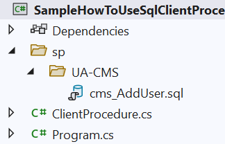

# SQL Client Procedure

This is a C# library to allow the usage of SQL Procedure without creating the actual Stored Procedure in SQL Server.

## Stored Procedure Problems

There are many benefits of using stored procedure, few of the reasons are to prevent SQL injection, minimize latency for batch operation, and also improve performance by reusing compiled execution plan.

However, stored procedure is located in database server and since the client (your application) resides in different location, there are disconnection between the two. When you change the parameter or results set in the stored procedure, you have to remember to update your application code too. Forget to do so leads to problems like parameter mismatches and invalid results set fields, which then can lead your application to crash or corrupted data.

The second point I want to bring here is regarding integrity. A stored procedure in database may be updated by a person unaware that Stored Procedure is being used by your application. Suddenly you received a call from your boss during your vacation about one critical function in production suddenly not working. Nervously, you open your laptop and found out there are thousands of parameter mismatch exception the log file. You check your code and  compare to the one in database only to find out there are one extra parameter added to the stored procedure in database.

The third point is regarding patching/release is more tedious and error prone. Lets says the end user has finally signed for the patch deployment, now you are ready to deploy both your app to production. However, how sure are you that the SQL scripts you prepare before is in sync with the one in database? Probably a few weeks ago user had discovered one bug and your college had fixed it by changing a stored procedure without telling you. So to be safe, you have a list of all changed stored procedure and copy all of the changed procedures from database then update your SQL patch script. Still, you may missed some changes that are not in your list.

The fourth point is regarding version control. Not like your app code, stored procedure usually are not version controlled or at least very hard to version controlled. This is due to the nature of stored procedure that lives and breath in database server. So, when a new changes is introduced to the app and stored procedure, the app code will be compiled into binary and manually SQL script (that contains only the changed stored proc) have to be patched to the database server. In summary, there are no direct correlation (or binding) between the app code and the stored procedure code.

The fifth point is also regarding versioning however it is related to the system versioning. Lets says your staging environment is at version 2.1 then suddenly user wants to revert the staging to version 2.0 so they could test some functionality. You could easily switch to your command line then git checkout the specific revision, recompile the the app and patch to the server. However you still have to manually revert stored procedure in database to version 2.0. After user finished testing the version 2.0, and ask you to revert to version 2.1, you have to manually revert the stored procedure to version 2.1 again. But, what if users want to test both version 2.0 and 2.1 at the same time you do you handle that? 

## How SQL Client Procedure Helps

There are a few key points how SQL Client Procedure helps:

- Procedure script (SQL file) is stored in the app project directory, so the SQL file can be source controlled. Essentially, the history of every changes made to the Stored Procedure can be tracked.
- The Procedure script (SQL file) will be embedded in the compiled binary file. This will simplify deployment of new changes since only a few artifacts is required to be moved and no SQL script has to be manually created and tracked.
- Client Procedure exists in the app itself, so the Procedure cannot be changed by external entity. This will prevent parameter mismatched, result set mismatch or untested Stored Procedure changes introduced to the system. Means the Stored Procedure integrity is retained.
- Multiple instance of different version of the app can run and use different version of Procedure and hit the same database at the same time.

## How To Use SQL Client Procedure

To use this SQL Client library, just copy the **ClientProcedure.cs** to the existing project. Then add the ``using`` statement to your code:

```c#
using SqlClientProcedure;
```

Create a directory to put the Procedure SQL file in the project. Then create a sub-directory for each database, for example ``UA-CMS`` as below. Then copy Stored Procedure from database into a text file with ***.sql** extension, for example ``cms_AddUser.sql`` below.



Below the sample of the **sql** file content:

```sql
create procedure cms_AddUser
	@s_UserID varchar(50),
	@s_Pwd varchar(50)
as

	declare @iAffectedRows int;

	set @iAffectedRows = 0
	
	if (not exists (select 1 from dbo.CMS_User where UserID = @s_UserID))
	begin
		insert into dbo.CMS_User (UserID, Pwd)
		select @s_UserID, @s_Pwd;

		set @iAffectedRows = @@rowcount;
	end

select @iAffectedRows AffectedRows;
```

Then put call to method ``InitClientProcedure`` like this and supply the name of Procedure script directory, for example ``sp``  as below during application start:

```c#
ClientProcedure.InitClientProcedure("sp");
```

Then add a call to function ```command.UseClientProcedure()``` prior calling the execute ```command.ExecuteReader``` or ```command.ExecuteNonQuery```.

```c#
// assuming this is the existing code in your system
using (SqlConnection connection = new SqlConnection(connectionString))
{
    string sProcName = "cms_AddUser";
    SqlCommand command = new SqlCommand(sProcName, connection);

    connection.Open();
    connection.ChangeDatabase("UA-CMS");

    command.Parameters.AddWithValue("@s_UserID", "test_user_4");
    command.Parameters.AddWithValue("@s_Pwd", "12345");

    command.UseClientProcedure(); // you just need to invoke "UseClientStoredProcedure" extension method

    var oReader = command.ExecuteReader();
    command.Parameters.Clear();

    oReader.Read();

    Console.WriteLine(oReader["AffectedRows"].ToString());
}
```

## How It Works

Within method ``InitClientProcedure``, the library will find the Procedure directory in the compiled binary (embedded resource). Once it located a`` *.sql`` file, it will parse the script and extract the:

- Stored Procedure Name
- Parameters
- Stored Procedure Body

These information will be stored into ``Procedure`` object then registered as an entry in a Dictionary data collection.

This will only done one time during the application start up.

Within method ``UseClientProcedure``, the command type will be changed to ``CommandType.Text`` and the Procedure Body value will replace the existing ``CommandText`` value (originally it was the name of Stored Procedure in database). To make sure SQL Server can use parameter sniffing correctly, all the parameter type will be updated according to the one defined in ``*.sql`` file.

So, when ``ExecuteReader`` or ``ExecuteNonQuery`` called, the actual SQL sent to SQL Server is the Stored Procedure Body instead of the Stored Procedure Name.

